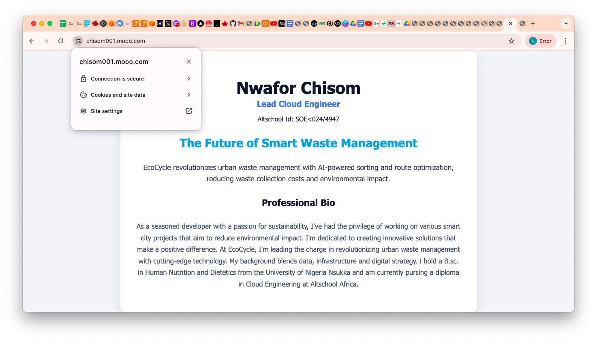
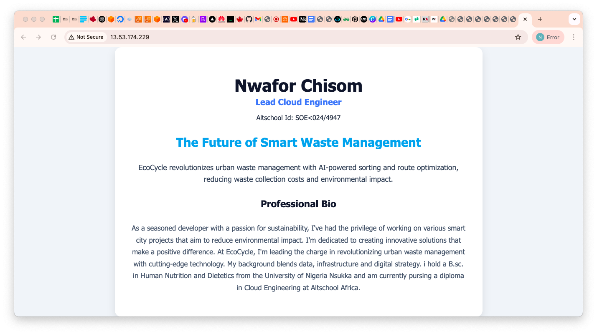
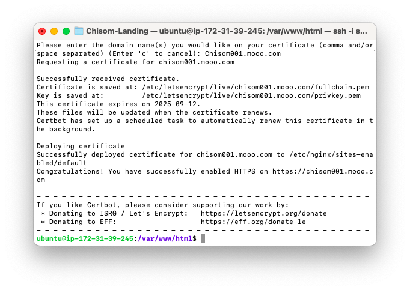
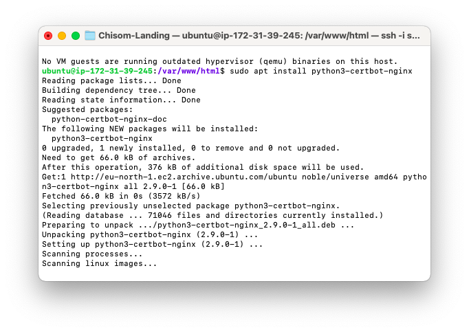

# AltSchool Web Application Project – Nwafor Chisom

## 🌍 Project Title
**ECOCYCLE – The Future of Smart Waste Management**

## 🧠 Project Pitch
EcoCycle revolutionizes urban waste management with AI-powered sorting and route optimization, reducing waste collection costs and environmental impact. Our platform merges sustainability with technology to make cities cleaner and smarter.

## 👩🏽‍💻 About Me
I’m Nwafor Chisom, a passionate and forward-thinking Cloud Engineer with a strong commitment to sustainability and automation. I’ve worked on cloud-native systems, built infrastructure-as-code pipelines, and automated deployments using tools like AWS, Nginx, and Linux. I’m driven by purpose and innovation, with hands-on experience in deploying scalable applications.

---

## ✅ Hosted Page
🔗 [Live Project URL](https://chisom001.mooo.com)

🌐 Public IP: [http://13.53.174.229](http://13.53.174.229)

---

## 📸 Screenshot of the Landing Page

### 🖥️ Full Landing Page View


### 🖥️ HTTP Unsecured View


### 📱 HTTPS with Certbot


### 🧩 Extra View or Animation


---

## 🔗 GitHub Repository

📁 [GitHub Repo – Ecocycle Landing Page](https://github.com/Noblesom/Ecocycle-land-page)

✉️ chisomn092@gmail.com

---

## 🛠️ Steps Taken

### 1️⃣ Server Provisioning (AWS EC2)
- Launched an **Ubuntu 22.04 LTS** instance via AWS EC2
- Used **t2.micro** instance (Free Tier)
- Downloaded `.pem` SSH key
- Opened these ports in the security group:
  - `22` – SSH
  - `80` – HTTP
  - `443` – HTTPS (for SSL)

---

### 2️⃣ Connecting to Server via SSH
```bash
ssh -i som_key.pem ubuntu@13.53.174.229
